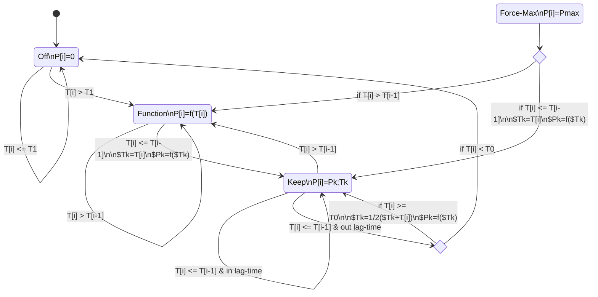

```mermaid
stateDiagram
	state "Off\nP[i]=0" as Off
    [*] --> Off
    Off --> Off : T[i] <= T1
    state "Function\nP[i]=f(T[i])" as Function
    Off --> Function : T[i] > T1
    Function --> Function : T[i] > T[i-1]
    state "Keep\nP[i]=Pk;Tk" as Keep
    Function --> Keep : T[i] <= T[i-1]\n\n$Tk=T[i]\n$Pk=f($Tk)
    Keep --> Function : T[i] > T[i-1]
    Keep --> Keep : T[i] <= T[i-1] & in lag-time
    state continually_drop <<choice>>
    Keep --> continually_drop : T[i] <= T[i-1] & out lag-time
    continually_drop --> Keep : if T[i] >= T0\n\n$Tk=1/2($Tk+T[i])\n$Pk=f($Tk)
    continually_drop --> Off : if T[i] < T0
    state "Force-Max\nP[i]=Pmax" as ForceMax
    state force_max_then <<choice>>
    ForceMax --> force_max_then
    force_max_then --> Function : if T[i] > T[i-1]
    force_max_then --> Keep : if T[i] <= T[i-1]\n\n$Tk=T[i]\n$Pk=f($Tk)
    

```

